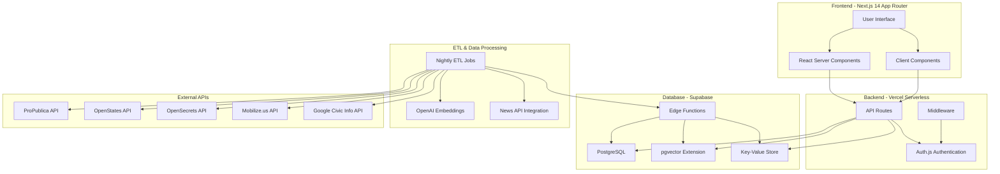

# VoteBrain Architecture

VoteBrain is a platform that helps voters make informed decisions by matching them with candidates and bills based on their values, providing lobbying data transparency, and connecting them with volunteer opportunities.

## System Architecture

## Component Architecture

### Frontend

- **Next.js 14 App Router**: The core framework for our application
  - **React Server Components**: For server-side rendering and data fetching
  - **Client Components**: For interactive UI elements like the survey and candidate filtering
  - **Tailwind CSS**: For styling
  - **React Context**: For global state management (replacing Flux from WeVote)

### Backend

- **Vercel Serverless Functions**: Powers our API routes
  - **/api/survey**: For survey submissions
  - **/api/candidates**: For candidate recommendations
  - **/api/bills**: For bill recommendations
  - **/api/volunteer**: For volunteer opportunities
  - **/api/inspiration**: For the inspiration feed
  - **/api/webhooks**: For ETL job triggers
- **Auth.js**: For authentication (reused from template)
- **Middleware**: For route protection and session management

### Database (Supabase)

- **PostgreSQL**: Main database storing all application data
  - **users**: User profiles with political preferences
  - **candidates**: Candidate information
  - **bills**: Legislative bill information
  - **lobby_contribs**: Lobbying contribution data
  - **org_partisanship**: Organization partisan data
  - **inspiration_posts**: Content for the inspiration feed
- **pgvector Extension**: For vector similarity search
- **Edge Functions**: For scheduled ETL tasks
- **Key-Value Store**: For caching API responses

### ETL & Data Processing

- **Scheduled Jobs**: Runs every night to update data
  - **ProPublica ETL**: Federal bills and legislators
  - **OpenStates ETL**: State bills and legislators
  - **OpenSecrets ETL**: Lobbying and campaign finance data
  - **Mobilize ETL**: Volunteer opportunities
  - **News ETL**: Current events for inspiration feed
- **Vector Embeddings**: Using OpenAI embeddings for similarity matching

## Data Flow

1. **User Registration/Login**: Users create accounts or log in through Auth.js
2. **Values Survey**: Users complete a survey about their political values
3. **Candidate/Bill Matching**: The system uses vector similarity to match users with candidates and bills
4. **Volunteer Matching**: Shows relevant volunteer opportunities based on user preferences
5. **Inspiration Feed**: Displays a feed of relevant political news and wins

## ETL Processes

- **Nightly ETL Jobs**: Run on schedules to refresh data
- **On-Demand Updates**: Triggered via webhooks for urgent updates
- **Embedding Generation**: Converts textual data to vector embeddings for similarity search

## Scalability Considerations

- **Cold-start Offload**: Moves heavy processing to background jobs
- **KV Caching**: Reduces database load for frequent requests
- **Vector Indexing**: Efficient similarity search even with large datasets
- **Edge Functions**: Distributes ETL load away from main application

## Security

- **Row-Level Security**: Protects user data in Supabase
- **Auth.js**: Handles secure authentication
- **Environment Variables**: Secures API keys and credentials
- **CORS Policies**: Restricts API access to approved domains

## Integration Points

- **ProPublica API**: Federal legislative data
- **OpenStates API**: State legislative data
- **OpenSecrets API**: Campaign finance and lobbying data
- **Mobilize.us API**: Volunteer events
- **Google Civic API**: Election and polling information
- **OpenAI API**: For generating embeddings

## Deployment

VoteBrain is deployed on Vercel's platform with Supabase providing the database infrastructure.